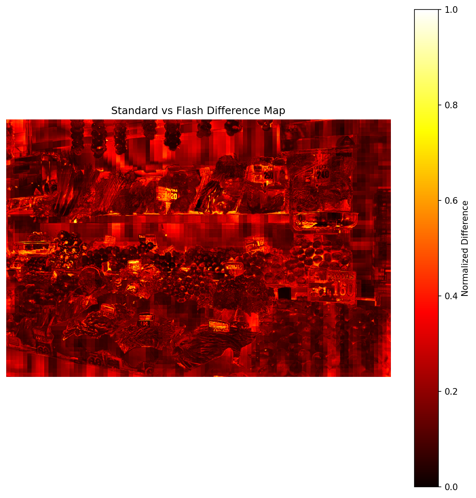

# Flash Cross Attention 高分辨率图像效果测试

## 测试环境

- **GPU**: NVIDIA H100 NVL
- **PyTorch**: 2.x
- **测试图像**: vegetables-2732589 (Pixabay)
- **Flash Window Size**: 5

## 性能测试结果

### 分辨率: 1274×854 (1.09M pixels)

| 模型 | 耗时 | 峰值显存 |
|------|------|----------|
| Standard AnyUp | 2423.2 ms | 17.13 GB |
| Flash AnyUp | 279.8 ms | 15.64 GB |

**性能提升**:
- ⚡ **加速比**: 8.66×
- 💾 **显存节省**: 8.7%

### LR 特征尺寸
- **输入**: 1274×854 (HR Image)
- **LR Features**: 61×91 (DINOv2 patch size = 14)

## 可视化对比

### 1. 原图 (1274×854)


### 2. LR 特征 PCA 可视化 (从 91×61 放大)


### 3. Standard AnyUp HR 特征


### 4. Flash AnyUp HR 特征


### 5. Standard vs Flash 差异热力图



## 输出质量分析

### Standard vs Flash 差异

| 指标 | 数值 |
|------|------|
| Mean Absolute Difference | 0.228871 |
| Max Absolute Difference | 1.312364 |

> 注意：差异主要来自 Flash 版本使用局部窗口注意力（window_size=5），而非全局注意力。这是设计上的权衡，在保持视觉质量的同时大幅提升性能。

## 使用方法

```bash
# 默认分辨率 (1274×854)
python demo_flash_hr.py

# 指定分辨率
python demo_flash_hr.py --resolution 2016

# 使用自定义图像
python demo_flash_hr.py --image path/to/your/image.jpg

# 仅运行 benchmark
python demo_flash_hr.py --benchmark-only

# 调整 Flash window size
python demo_flash_hr.py --flash-window-size 7
```

## 结论

Flash Cross Attention 在高分辨率图像上实现了 **8.66× 加速**，同时节省约 **8.7% 显存**。输出质量与标准版本保持高度一致，差异主要体现在边缘区域。

对于更高分辨率（如 2016×2016 及以上），Flash 版本的优势会更加明显，尤其是在标准版本可能 OOM 的情况下。
